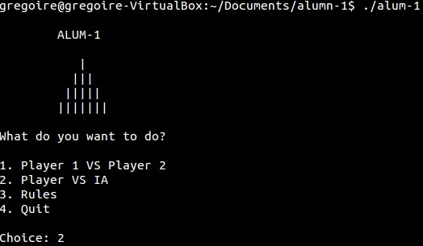

alumn-1
=======

### What is it?
Nim is a mathematical game of strategy in which two players take turns removing objects from distinct heaps. On each turn, a player must remove at least one object, and may remove any number of objects provided they all come from the same heap. It was developed in February 2011.

### Instructions project
- The goal is to make a program which you can play against
- The IA must be developped using Marienbad algorithm

### Authors and Contributors
Developed by Gregoire Borel (@gregoireborel)
